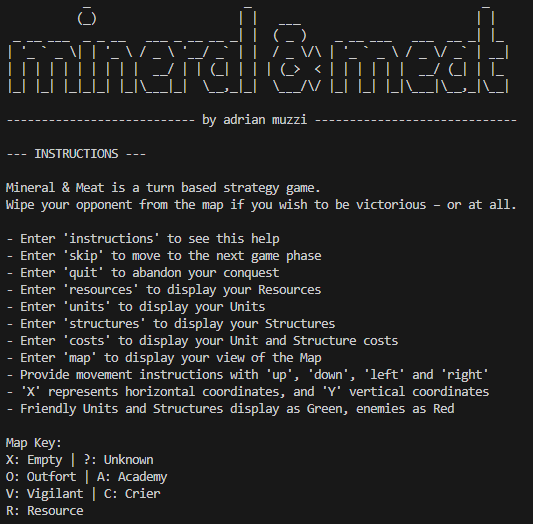
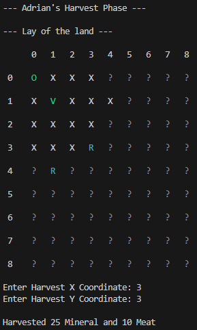

# Mineral & Meat
A turn-based strategy game framework in C# Dotnet, built with extensibility in mind. Featuring a modular architecture for units, structures, and map logic, Mineral & Meat is a tactical sandbox for experimenting with grid-based combat mechanics and AI behavior.

<p align="center">  </p>

## ⚔️ Features

- **Turn-Based Gameplay**: Clear phase structure for player and AI turns.
- **Grid-Based Map System**: Supports terrain types, visibility, and movement cost.
- **Unit Management**: Modular unit definitions with stats, abilities, and actions.
- **AI Opponent**: Customizable AI logic with decision-making and prioritization.
- **Console UI**: Text-based rendering for lightweight debugging and testing.

<p align="center">  </p>

## 🧱 Built to Expand

This is very much a prototype at current - the functionality is there, though the game needs to be designed and extended through already existing frameworks (hopefully by an individual with a natural grace for game design)

The designed has a clean separation of game logic, data models, and rendering — making it easy to: Add new unit types, abilities, and resources. Could also create new map layouts or, as good practice, develop procedural map generation.

Additional features are possible, of specific need is a development of unit and structure types and behaviours.

Another promising addition is the introduction graphical front-end without reworking core logic.

I built this as a jaunt into the world of C# and .NET, and it's ready to build upon.

### 🤝 Contributing
Any and all pull requests and forks are welcome! Feel free to open issues or reach out.

## 🗂️ Project Structure
```
Mineral-and-Meat/
├── lib/                 # External libraries or modules
├── public/              # Public assets like images
├── AIPlayer.cs          # AI logic and behavior
├── Academy.cs           # Game state management
├── Crier.cs             # Handles in-game messaging or notifications
├── CustomProject.csproj # Project configuration file
├── GameManager.cs       # Core game loop and state transitions
├── GamePhase.cs         # Definitions for different game phases
├── IAttackable.cs       # Interface for attackable entities
├── Map.cs               # Map layout and tile management
├── MapObject.cs         # Base class for objects placed on the map
├── Outfort.cs           # Specific structure or building logic
├── Player.cs            # Player-related data and actions
├── Program.cs           # Entry point of the application
├── Resource.cs          # Resource definitions and handling
├── ResourceType.cs      # Enumeration of resource types
├── Structure.cs         # Base class for structures/buildings
├── Tile.cs              # Tile definitions and properties
├── Unit.cs              # Base class for units/characters
├── Vigilant.cs          # Specific unit type with unique behavior
└── .gitignore           # Git ignore file
```

## 🛠️ Get Started

You'll need .NET SDK (version 8.0 or higher) - https://dotnet.microsoft.com/en-us/download

### Installation

**1. Clone the repository**:

```bash
git clone https://github.com/adrianmuzzi/Mineral-and-Meat.git
cd Mineral-and-Meat
```

**2. Build and Run**

```bash
dotnet build
dotnet run
```

## 📄 License
This project is open-source and available under the MIT License.
